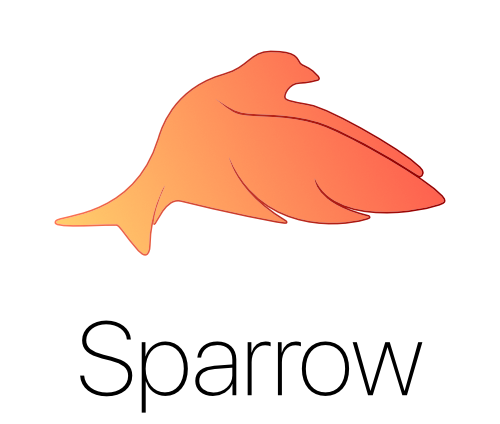

<p align="center">


</p>

# Sparrow

Sparrow is a lightweight framework for building modern RESTful APIs.

### Usage

```swift
let router = Router()

router.get { context in

    return ResponseContext(
        status: .ok,
        message: "Hello world!"
    )
}

let server = try HTTPServer(port: 8080, responder: router)
try server.start()
```


## Credits

Based off [Zewo](https://github.com/Zewo)

- David Ask ([@davidask](https://github.com/davidask))
- Paulo Faria ([@paulofaria](https://github.com/paulofaria))

## License

Pin is released under the MIT license. See LICENSE for details.

## About Formbound

[Formbound AB](https://github.com/formbound) is a software development firm devoted to open-source development.