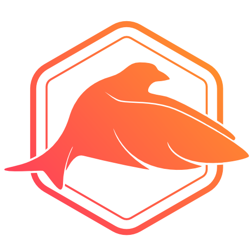

 
 

# Sparrow

Sparrow is a lightweight framework for building modern RESTful APIs.

## Credits

Based off [Zewo](https://github.com/Zewo)

- David Ask ([@davidask](https://github.com/davidask))
- Paulo Faria ([@paulofaria](https://github.com/paulofaria))

## License

Sparrow is released under the MIT license. See LICENSE for details.

## About Formbound

[Formbound AB](https://github.com/formbound) is a software development firm devoted to open-source development.
